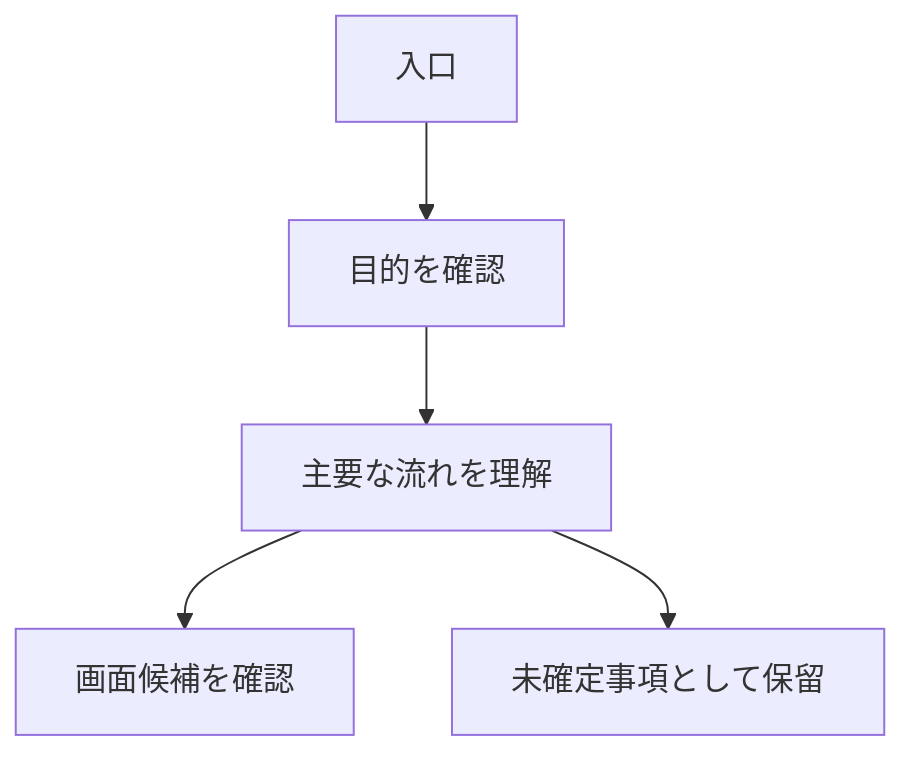

# IDEA BOARD Template

- Status: active
- Scope: `Ryosuke-Shigi/codex-practice001` / IDEA BOARD docs template
- Last reviewed: 2026-07-05
- Canonical source: IDEA BOARD 作成時のMarkdownテンプレート

## このテンプレートの目的

このテンプレートは、IDEA BOARD を作る時に、お客様へ機能の考え方を分かりやすく伝えるための型です。

IDEA BOARD は、画面そのものを作る場所ではありません。主役は、機能の目的、流れ、価値、使い方、構造の説明です。フローチャート、図、グラフ、説明文を組み合わせ、文章だけで埋めないようにします。

MOCKへ渡す前に、機能の考え方と画面候補を整理します。コーディング関係を入れる場合は、IDEA BOARD内の `code` タブに必要最小限だけ入れます。`code` タブは補助であり、IDEA BOARDの主役にしません。

共通の画面構造と内部向け作業注意は [idea-board-and-mock-template-policy.md](idea-board-and-mock-template-policy.md) を正本とします。

## 使い方

- 新しいIDEA BOARD docsを作る時に、必要な見出しをコピーして使う。
- お客様が機能の目的、流れ、価値、使い方を理解できることを優先する。
- フローチャート、図、グラフ、説明文を組み合わせる。
- 不明な項目は推測で埋めず、未確定事項へ置く。
- `code` タブは必要な場合だけ使い、主要説明より前に出さない。

## テンプレート

```md
# <対象名> IDEA BOARD

- Status: active
- Scope: <対象repo / 対象機能 / IDEA BOARD>
- Last reviewed: YYYY-MM-DD
- Canonical source: <このIDEA BOARDで説明する内容>

## 概要

- <どの機能を説明するIDEA BOARDか>
- <お客様に何を理解してもらうか>
- <今回扱う範囲>

## お客様に伝えること

- <機能の目的>
- <利用者にとっての価値>
- <どの場面で使うか>
- <何が分かりやすくなるか>

## 上位タブ

| タブ | 役割 | 見せる主な内容 |
|---|---|---|
| 概要 | 機能の目的と前提を伝える | 目的 / 利用者 / 価値 / 解決したいこと |
| フロー | 利用の流れを伝える | 手順 / フローチャート / 分岐 |
| 機能説明 | できることを説明する | 主要機能 / 操作イメージ / 補足 |
| 画面候補 | MOCKで作る画面候補を整理する | TOP / 登録 / 一覧 / 詳細など |
| 図解 | 構造や関係を見せる | 概念図 / 関係図 / 配置イメージ |
| グラフ | 数値や状態の見せ方を説明する | グラフ例 / 状態表示 / 比較 |
| code | 実装時の補助メモを必要最小限だけ置く | Page / Component / Type候補 / 技術メモ |

## 薄いファイルタグ

選択中タブの中で、見る内容を薄いファイルタグで切り替える。

タグ例:

- 目的
- 流れ
- 図解
- グラフ
- 画面候補
- 補足

薄いファイルタグは高さを取りすぎず、本文領域を圧迫しない。

## 概要

- <機能の目的>
- <利用者>
- <利用場面>
- <解決したい課題>

## フロー

1. <最初に起きること>
2. <利用者が判断すること>
3. <次に表示したいこと>
4. <MOCKへ渡すこと>

### フローチャート例



## 機能説明

| 項目 | 説明 | お客様に確認したいこと |
|---|---|---|
| <機能> | <説明> | <確認したいこと> |

## 画面候補

| 画面候補 | 目的 | MOCKで見るもの |
|---|---|---|
| TOP | 最初の入口を見せる | タイトル / 主要ボタン / 補足表示 |
| 登録 | 入力の流れを見せる | 入力欄 / 登録ボタン / 入力補助 |
| 一覧 | 情報の探し方を見せる | 一覧 / 絞り込み / 詳細への導線 |
| 詳細 | 1件の内容を見せる | 基本情報 / 関連情報 / 操作 |

## 図解

- <構造を説明する図>
- <関係を説明する図>
- <画面候補のつながりを説明する図>

## グラフ

- <数値や状態を見せるグラフ>
- <比較したい内容>
- <お客様が判断しやすくなる見せ方>

## code

`code` タブは補助です。お客様向けの主要説明より前に出さない。

入れてよいもの:

- Page候補:
- Component候補:
- Type候補:
- PRODUCT化前に確認する技術メモ:

未確認の実装名、DB構造、Backend層を確定仕様として書かない。

## MOCKへ渡すために決めること

- <最初にMOCK化する画面>
- <画面で見せたい内容>
- <画面でお客様に理解してもらうこと>
- <画面に必要な図 / グラフ / 絵>
- <確認したい操作>
- <状態表示として見せるもの>
- <まだ画面化しないもの>

## 未確定事項

| 項目 | 未確定の理由 | 次に決めること |
|---|---|---|
| <項目> | <理由> | <決めること> |

## 内部向け作業注意

この見出しは作業者向けです。お客様向けの主要説明ではありません。

- IDEA BOARDからMOCK画面への通常リンクを作らない。
- `code` タブを主役にしない。
- 未確認の仕様、実装名、DB構造、本番API、本番業務判断を確定扱いしない。
- secrets / `.env` / APIキー / token / cookie / session / 個人情報を混ぜない。
- UI実装、Route追加、Component追加、DB、Migration、API、Backend層、Docker、本番反映へ進む場合は別作業にする。

## PR前確認項目

- IDEA BOARDが、お客様に機能を説明する資料として読めるか。
- フローチャート、図、グラフ、説明文を使う方針があるか。
- 文章だけで埋める構成になっていないか。
- 画面候補をMOCKへ渡せる形で整理しているか。
- `code` タブが補助として扱われているか。
- 内部向け作業注意が、お客様向け本文の中心から外れているか。
- secretsや個人情報が混入していないか。
```

## IDEA BOARDで大事にすること

- お客様が機能の目的、流れ、価値、使い方を理解できること。
- フローチャート、図、グラフ、説明文を組み合わせること。
- 画面候補をMOCKへ渡せる粒度で整理すること。
- `code` タブは補助に留めること。
- 内部向け作業注意を、お客様向け本文の中心に置かないこと。
