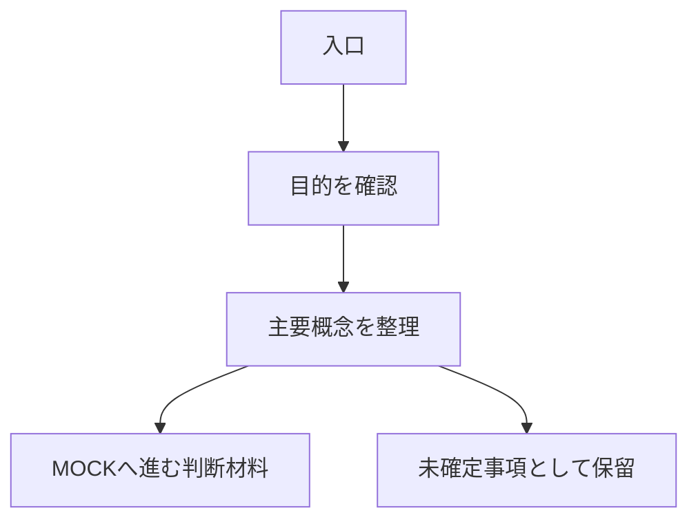

# IDEA BOARD Template

- Status: active
- Scope: `Ryosuke-Shigi/codex-practice001` / IDEA BOARD docs template
- Last reviewed: 2026-07-05
- Canonical source: IDEA BOARD 作成時のMarkdownテンプレート

## このテンプレートの目的

このテンプレートは、IDEA BOARD を作る時に、構想、目的、利用者、課題、導線、責務、未確定事項、次に決めることを整理するための型です。

IDEA BOARD は説明用の段階です。画面の見た目より、概念、流れ、責務、未確定事項、次工程へ渡す判断材料を主役にします。

完成仕様、本番構成、DB構造、本番API、本番業務判断を断定しません。

共通の画面構造と禁止事項は [idea-board-and-mock-template-policy.md](idea-board-and-mock-template-policy.md) を正本とします。

## 使い方

- 新しいIDEA BOARD docsを作る時に、必要な見出しをコピーして使う。
- 不明な項目は推測で埋めず、未確定事項へ置く。
- UIを作り込みすぎず、文字、簡単な表、Mermaidなどのフローチャートで整理する。
- MOCK、PROTOTYPE、PRODUCT、DB、API、本番業務ロジックへ進まない。

## テンプレート

````md
# <対象名> IDEA BOARD

- Status: active
- Scope: <対象repo / 対象機能 / IDEA BOARD>
- Last reviewed: YYYY-MM-DD
- Canonical source: <このIDEA BOARDで固定する内容>

## 概要

- <何を考えるIDEA BOARDか>
- <どの段階の文書か>
- <今回のIDEA BOARDで扱う範囲>

## 目的

- <何を整理したいか>
- <次工程へ何を渡したいか>

## 想定利用者

- <主な利用者>
- <利用場面>
- <利用者が迷いやすい点>

## 解決したい課題

| 課題 | 現状 | IDEA BOARDで整理すること |
|---|---|---|
| <課題> | <現状> | <整理する観点> |

## 画面構造

IDEA BOARD画面は次の順序を基本にする。

```text
コンパクトなタイトル
  ↓
上位タブ
  ↓
選択中タブ内のインデックス
  ↓
内容表示エリア
```

- タイトル、タブ、インデックスは大きくしすぎない。
- 内容表示エリアを主役にする。
- 内容表示エリアだけをスクロール対象にする。
- 「内容表示エリアだけをスクロール対象にする」は、内容を小さい箱へ押し込める意味ではない。
- ページ全体を長く縦スクロールさせない。
- 選択中タブと選択中インデックスの内容だけを表示する。

## 内容表示エリアの高さ保証

- 内容表示エリアは、選択中タブ・インデックスの内容を読むための主領域として十分な高さを確保する。
- タイトル、タブ、インデックス、補足説明、余白で画面上部を圧迫し、内容表示エリアが1行〜数行しか見えない状態にしてはならない。
- スマートフォン縦表示でも、まとまった本文、表、Mermaidなどのフローチャートを確認できる高さを残す。
- `overflow-y-auto` は、十分な高さを確保した内容表示エリアに対して使う。
- `overflow-y-auto` を指定していても、親要素の高さ設計や `flex-1` / `min-h-0` 不足によりスクロール領域が潰れている場合は失敗とする。
- 内容表示エリアが潰れる場合は、タイトル、タブ、インデックス、余白、補足説明の量を減らし、内容表示エリアを優先する。

## 上位タブ

| タブ | 役割 | 表示する主な内容 |
|---|---|---|
| 概要 | 目的と前提を整理する | 目的 / 利用者 / 課題 / 解決方針 |
| TOP | 最初の入口を整理する | 現在位置 / 主要導線 / 後続余白 |
| 登録 | 入力入口を整理する | 入力項目 / 登録前判断 / 登録後の流れ |
| 一覧 | 確認入口を整理する | 表示対象 / 絞り込み候補 / 状態表示 |
| 詳細 | 1件の詳細を整理する | 表示情報 / 関連情報 / 操作候補 |
| フロー | 概念の流れを整理する | 簡易フロー / Mermaid |
| Coding | 将来の実装候補を整理する | Page候補 / Component候補 / Backend化時の注意 |

## タブ内インデックス

### 概要タブ

- 目的
- 利用者
- 課題
- 解決方針
- 未確定事項

### 登録タブ

- 入力項目
- 登録前の判断
- 登録後の流れ
- 作らない処理

### 一覧タブ

- 表示対象
- 絞り込み候補
- 状態表示
- 未確定事項

### 詳細タブ

- 表示情報
- 関連情報
- 操作候補
- 次工程

### Codingタブ

- Page候補
- Component候補
- DTO候補
- Backend化時の注意
- PRODUCT化時に作り直す責務

## 想定する画面導線

```text
<入口>
  ↓
<主要画面>
  ↓
<次に確認したい画面>
```

- <導線1>
- <導線2>
- <導線3>

## 主要概念

| 概念 | 説明 | 未確定事項 |
|---|---|---|
| <概念> | <説明> | <未確定> |

## 簡易フロー

1. <最初に起きること>
2. <利用者が判断すること>
3. <次に表示したいこと>
4. <MOCKへ渡すこと>

## Mermaidフローチャート例



## 必要そうな機能

- <必要そうな機能>
- <必要そうな画面>
- <必要そうな表示>

## 今は作らないもの

- React Component
- 共通UI Component
- Page実装
- Hook
- TypeScript型
- Laravel Controller
- Request
- Action
- Service
- Repository
- DTO
- Responder
- Model
- Migration
- API通信
- DB保存
- PRODUCT実装
- Docker変更
- 本番反映

## 未確定事項

| 項目 | 未確定の理由 | 次に決めること |
|---|---|---|
| <項目> | <理由> | <決めること> |

## MOCKへ進むために決めること

- <最初にMOCK化する画面>
- <固定データで確認する表示>
- <確認したい操作>
- <状態表示として見せるもの>
- <まだMOCKに入れないもの>

## Coding観点

- Page候補:
- Component候補:
- 固定データ候補:
- Backend化時の注意:
- PRODUCT化時に作り直す責務:

## 責務境界メモ

このIDEA BOARDでは、Backend層の実装へ進まない。

PRODUCT化時に必要になりそうな候補として、Controller / Request / Action / Service / Repository / DTO / Responder の名前を出してよい。

ただし、実装済みや確定仕様として断定しない。

## PR前確認項目

- IDEA BOARDが文字、表、フローチャート中心になっているか。
- UIを作り込みすぎていないか。
- タイトル、タブ、タブ内インデックス、内容表示エリアの構造になっているか。
- 内容表示エリアだけをスクロール対象にする方針があるか。
- 内容表示エリアが1行〜数行しか見えない状態を失敗として扱っているか。
- スマートフォン縦表示でも、まとまった本文、表、フローチャートを確認できる高さを残しているか。
- `overflow-y-auto`、親要素の高さ設計、`flex-1`、`min-h-0` の確認観点があるか。
- 選択中の内容だけを表示する方針があるか。
- MOCKへ進むために決めることが明記されているか。
- DB / Migration / API / PRODUCT実装 / 共通Component化へ進んでいないか。
- secretsや個人情報が混入していないか。
````

## IDEA BOARDで避けること

- 見た目を作り込みすぎる。
- すべての説明を1ページに縦長表示する。
- 説明文を上部へ詰め込みすぎて、本文やフローチャートを読む領域を潰す。
- Mermaidや表を1行程度の窓で見せる。
- 完成仕様、本番構成、DB構造、本番API、本番業務判断を断定する。
- MOCK、PROTOTYPE、PRODUCTの実装へ進む。
- 共通Component化の判断をこの段階で確定する。
